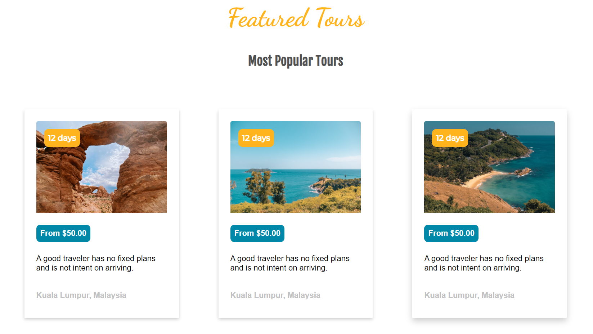

# :mountain: Traveller, travel tour page made with HTML & CSS

 ## Welcome to Traveller agency
 
This is a Travel destinations tour website made with html / css 

## How was it built 

The project was divided into three parts, a header where the navbar is located, and from there you can access the different sections of the website. Then these sections begin, divided into a brief description of the agency, the destinations and the tours that can be carried out. And, at the end, the footer, with links to important and interesting information for clients and a subscription to the newsletter to know the latest about the agency.
The project was carried out mostly with flex-box and grid tools, element positioning and various styles to provide good interaction to users.

-----
## Home page

-----
## Travel destinations

-----

## Tours

-----
## Final result

You can visit the Webpage here: [Traveller website](https://agostino08.github.io/Travel-Page/)

-----

Made by [agostino08](https://github.com/agostino08)
